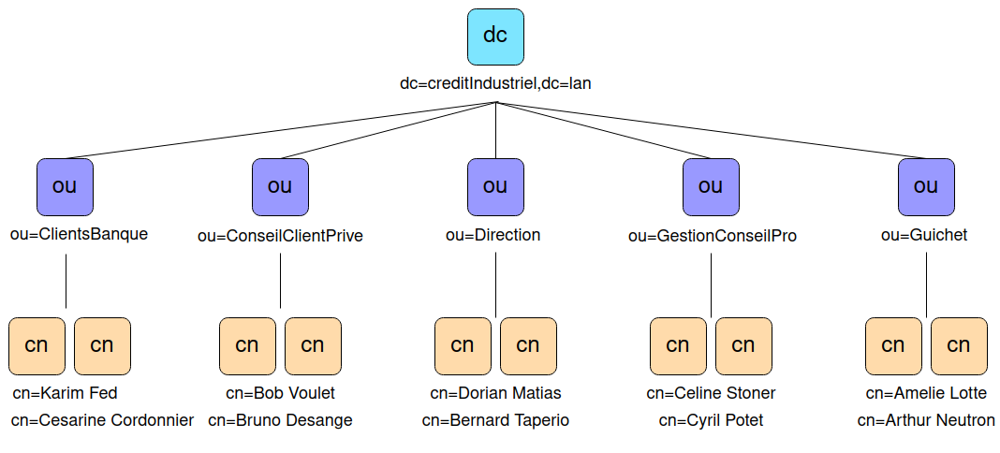

- # LDAP
	-
	- ## Installation LDAP
		- `sudo apt-get install slapd ldap-utils`
		- Pas besoin de mettre un mot de passe, on va le définir plus tard.
		-
		- `sudo dpkg-reconfigure slapd`
		- Choisir <Non>
		- Choisir le nom de domaine DNS pour établir le DN (Distinguished Name) de l'annuaire LDAP :
		- `creditIndustriel.lan`
		- Choisir le nom d'entité "organisation" :
		- `creditIndustriel`
		- Définir le mot de passe de l'administrateur :
		- `****`
		- `****`
		- Choisir s'il faudra supprimer la base de données lors de la purge du paquet (<Nom>)
		- Choisir <Oui> pour déplacer l'ancienne base de données car les fichiers présents dans /var/lib/ldap provoqueraient l'échec de la procédure de configuration.
		-
	- ## Vérification
		- La racine du DIT (Directory Information Tree) a été configuré à "dc=creditIndustriel,dc=lan", donc on peut le visualiser en faisant :
		- `sudo ldapsearch -Q -L -Y EXTERNAL -H ldapi:/// -b dc=creditIndustriel,dc=lan`
		- `-Q`
		- active le mode silencieux pour l’authentification SASL.
		- `-Y`
		- indique le mode SASL choisi pour l’authentification. Normalement, EXTERNAL implique une authentification par certificat client, mais dans ce cas-là, ça signifie que l’authentification se fera par l’UID et le GID du compte système. C’est pour ça que vous devez lancer la commande avec “sudo”. L’utilisateur root a des passe-droits pour accéder à la base locale LDAP. :)
		- `-L`
		- indique d’afficher le résultat au format LDIF. On aurait pu indiquer  -LLL  pour avoir la même chose sans toutes les lignes commentées.
		- `-H`
		- indique l’URI qu’on veut utiliser pour se connecter. Ici  ldapi:///  dit de se connecter à la socket Unix en local (la communication passe par un fichier local plutôt que par le réseau).
		- `-b`
		- indique le nœud à partir duquel vous voulez faire votre recherche. Ici  dc=mon-entreprise,dc=com  est la racine donc vous recherchez dans tout le DIT. À la suite du nœud, vous auriez pu indiquer des filtres pour votre recherche, mais sans filtre vous avez l’affichage le plus complet.
	-
	- ## Structure du DIT
		-
		- 
collapsed:: true
			-
			-
			-
-
	- ## Le format ldif
		- LDIF (LDAP Directory Interchange Format) est un format créé pour décrire les ajouts ou les modifications à réaliser dans un annuaire LDAP. Le format d'une entrée dans un fichier LDIF est toujours de la forme suivante :
		- `dn: <Le dn que vous voulez changer>`
		- `changetype: <add, replace ou delete. Cette ligne est optionnelle>`
		- `<attribut ou objectclass>: valeur`
		-
	- ## Fichier ldif pour construire le DIT :
		-
-
