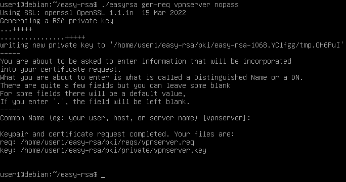
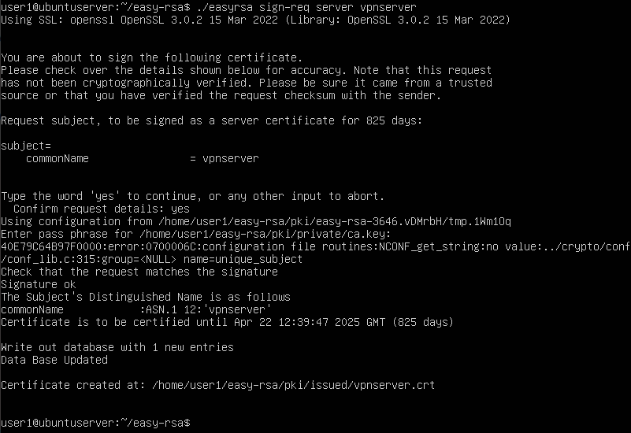

- Ajouter un utilisateur à un groupe :
	- `sudo usermod -a -G [group] [user]`
	- pour acl selon chatGPT :
		- `sudo apt-get install acl attr`
- Pour avoir "nfs4_getfacl"
	- `apt install nfs4-acl-tools`
-
- ### Étapes suivis pour openVPN :
	- #### Installation OpenVPN et Easy-RSA :
		- `sudo apt update`
		- `sudo apt install openvpn easy-rsa`
		- `mkdir ~/easy-rsa`
		- `ln -s /usr/share/easy-rsa/* ~/easy-rsa/`
		- `chmod 700 ~/easy-rsa`
	- #### Création d'une IPC (Infrastructure à clé publique) pour OpenVPN :
		- `cd ~/easy-rsa`
		- `nano vars`
			- `set_var EASYRSA_ALGO "ec"` (peut être à changer)
			  `set_var EASYRSA_DIGEST "sha512"`
			- Configurer vos serveurs OpenVPN & AC pour utiliser l’ECC signifie que lorsqu’un client et un serveur tentent d’établir une clé symétrique partagée, ils peuvent utiliser des algorithmes de courbe elliptique pour effectuer leur échange. L’utilisation de l’ECC pour un échange de clés est nettement plus rapide que l’utilisation de la méthode de Diffie-Hellman avec l’algorithme RSA classique, car les nombres sont beaucoup plus petits et les calculs sont plus rapides.
		- `./easyrsa init-pki`
	- #### Création d’une demande de certificat de serveur OpenVPN et d’une clé privée :
		- `cd ~/easy-rsa`
		- `./easyrsa gen-req vpnserver nopass`
			- 
		- `sudo cp /home/user1/easy-rsa/pki/private/vpnserver.key /etc/openvpn/server/`
	- #### Signer la demande de certificat :
		- Envoyer la demande de signature de certificat au serveur CA :
			- `scp /home/user1/easy-rsa/pki/reqs/vpnserver.req user1@192.168.1.100:/tmp`
		- Sur le CA :
			- `cd ~/easy-rsa`
			- `./easyrsa import-req /tmp/vpnserver.req vpnserver`
			- On signe :
				- `./easyrsa sign-req server vpnserver`
					- 
			- Copier les fichiers "vpnserver.crt" et "ca.crt" vers le serveur VPN (Il faut que openssh-server soit installé sur le serveur VPN)
				- `scp pki/issued/vpnserver.crt user1@your_vpn_server_ip:/tmp`
				- `scp pki/ca.crt user1@your_vpn_server_ip:/tmp`
		- On retourne sur le serveur VPN :
			- On copie les certificats dans `/etc/openvpn/server`
				- `sudo cp /tmp/{server.crt,ca.crt} /etc/openvpn/server`
-