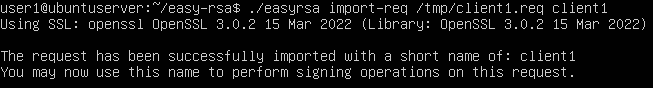
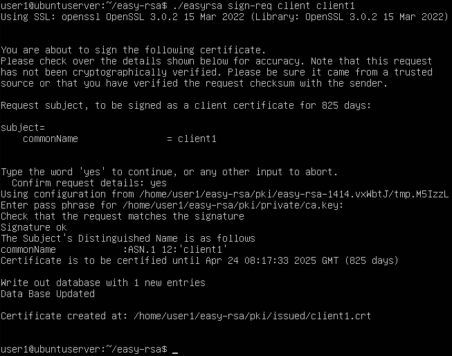
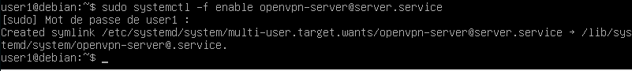
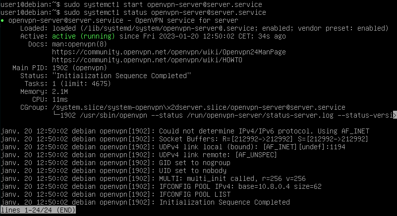

- ### Suite de hier :
	- ### Sur le serveur CA
		- `cd ~/easy-rsa`
		- Importer :
			- `./easyrsa import-req /tmp/client1.req client1`
			- 
		- Signer :
			- `./easyrsa sign-req client client1`
				- Taper `yes`
				- Taper le mot de pass de la clé AC
				- 
		- Cela crée un fichier certificat `client1.crt` que l'on va envoyer au serveur VPN :
			- `scp pki/issued/client1.crt user1@192.168.1.200:/tmp`
	- ### Retour sur le serveur VPN :
		- Copiez le certificat du client sur le répertoire ~/client-configs/keys/ :
			- `cp /tmp/client1.crt ~/clientconfigs/keys/`
		- copier le fichier `ca.crt` et `ta.key` aux fichiers `~/client-configs/keys/` et définissez les permissions appropriées à l'utilisateur sudo :
			- `cp ~/easy-rsa/ta.key ~/client-configs/keys/`
			- `sudo cp /etc/openvpn/server/ca.crt ~/client-configs/keys/`
			- `sudo chown user1.user1 ~/client-configs/keys/*`
		- Avec cela, les certificats et les clés de votre serveur et de votre client ont tous été générés et sont stockés dans les répertoires appropriés sur votre serveur OpenVPN. Il reste encore quelques actions à effectuer avec ces fichiers, mais elles interviendront dans une étape ultérieure. Pour l’instant, vous pouvez passer à la configuration d’OpenVPN.
	- ### Configurer OpenVPN
		- Copier l’échantillon `server.conf` comme point de départ pour le fichier de configuration :
			- `sudo cp /usr/share/doc/openvpn/examples/sample-config-files/server.conf /etc/openvpn/server/`
		- Éditer le fichier `/etc/openvpn/server/server.conf`:
			- Commenter les lignes :
				- `;tls-auth ta.key 0 # This file is secret`
				- `;cipher AES-256-CBC`
				- `;dh dh2048.pem`
			- Ajouter :
				- `tls-crypt ta.key`
				- `cipher AES-256-GCM`
				- `auth SHA256`
				- `dh none`
			- Décommenter :
				- `user nobody`
				- `group nogroup`
			- Modifiez le DNS pour rediriger tout le trafic par le VPN (facultatif):
				- Décommenter :
					- `push "redirect-gateway def1 bypass-dhcp"`
					- `push "dhcp-option DNS 208.67.222.222"`
					- `push "dhcp-option DNS 208.67.220.220"`
						- Ces lignes indiqueront à votre client d’utiliser les résolveurs OpenDNS gratuits aux adresses IP indiquées. Si vous préférez d’autres résolveurs DNS, vous pouvez les substituer à la place des IP mis en évidence.
			- Il est possible d'ajuster le port et le protocole :
				- voir https://www.digitalocean.com/community/tutorials/how-to-set-up-and-configure-an-openvpn-server-on-ubuntu-20-04-fr
			- Pointer vers la bonne clé et le bon certificat :
				- `cert vpnserver.crt`
				- `key vpnserver.key`
	- ## Ajustement de la configuration réseau du serveur
		- Dans `/etc/sysctl.conf` ajouter à la fin :
			- `net.ipv4.ip_forward = 1`
		- Pour charger les nouvelles valeurs :
			- `sudo sysctl -p`
	- ### Configuration du pare-feu
		- `sudo apt install ufw`
		- Déterminer l'interface de réseau public :
			- `ip route list default`
		- Ajouter les lignes suivantes à `/etc/ufw/before.rules` :
			- `# START OPENVPN RULES`
			- `# NAT table rules`
			- `*nat`
			- `:POSTROUTING ACCEPT [0:0]`
			- `# Allow traffic from OpenVPN client to enp0s3`
			- `-A POSTROUTING -s 10.8.0.0/8 -o enp0s3 -j MASQUERADE COMMIT`
			- `# END OPENVPN RULES`
		- Dans `/etc/default/ufw` passer la valeur de DEFAULT_FORWARD_POLICY à ACCEPT :
			- `DEFAULT_FORWARD_POLICY="ACCEPT"`
		- `sudo ufw allow 1194/udp`
		- `sudo ufw disable`
		- `sudo ufw enable`
	- ## Démarrer OpenVPN :
		- `sudo systemctl -f enable openvpn-server@server.service`
			- 
		- `sudo systemctl start openvpn-server@server.service`
		- `sudo systemctl status openvpn-server@server.service`
			- 
-