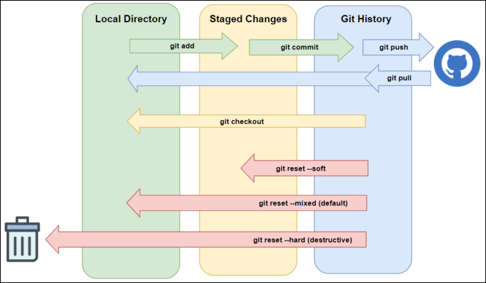

- ## Configuration
- Pour que la configuration se fasse de manière globale (sur tous les projets), il faut ajouter le `flag --global`
	- `git config --global user.name "name"`
	- `git config --global user.email email@ex.com`
	- `git config --global color.diff auto`
	- `git config --global color.status auto`
	- `git config --global color.branch auto`
	- `git config --global core.editor vim`
	- `git config --global merge.tool vimdiff`
- Pour voir la configuration
	- `git config --local --list`
	- ou
	- `git config --global --list`
-
- ## Liste des commandes
- Initier un nouveau projet dans le répertoire courant
	- `git init`
- Relier le dépot local au dépot distant
	- `git remote add origin https://github.com/user/project.git`
- Renommer la branche principale
	- `git branch -M main`
- Indexer (ou stager)
	- `git add <file1 file2...>`
- Commit
	- `git commit -m "description"`
- Push
	- `git push origin main`
- Afficher les branches
	- `git branch`
- Créer une branche
	- `git branch branchName'
- Basculer sur une branche
	- `git checkout branchName`
- Créer une branche et basculer dessus
	- `git checkout -b branchName`
- Fusionner
	- Basculer sur la branche sur laquelle on veut fusionner et faire :
	- `git merge branchName`
- Cloner un dépot distant
	- `git clone https://github.com/user/project`
- Ajouter un pointeur vers un dépot distant (par défault origin)
	- `git remote add pointerName https://github.com/user/project`
- Mettre à jour en local
	- `git pull origin main`
- Supprimer une branche
	- `git branch -d branchName`
- Modifier le message du dernier commit
	- `git commit --amend -m "Nouveau message du commit"`
- Lister les commit
	- `git log`
- Lister toutes les actions
	- `git reflog`
- Examiner toutes les modifications faite sur un fichier
	- `git blame file.php`
- Remise (ou stash)
	- `git stash`
- voir la liste des remises
	- `git stash list`
- Appliquer le dernier stash ou un autre
	- `git stash apply`
	- `git stash apply stash@{1}`
- Supprimer le dernier commit
	- `git reset --hard  HEAD^`
- Réappliquer le dernier commit
	- `git reset --hard commitId1234567`
- Ajouter un fichier dans le dernier commit
	- `git add forgottenFile && git commit --amend --no-edit`
- Reset peut s'utiliser avec les options
	- `--hard` : Annule les changements dans le répertoire de travail et dans l'historique des commits jusqu'au commit cible.
	- `--mixed` (ou simplement omis) : Déplace le pointeur vers le commit cible tout en conservant les changements non validés dans le répertoire de travail.
	- `--soft` : Déplace le pointeur vers le commit cible en conservant les changements non validés dans l'index et le répertoire de travail.
	- 
- Revenir en arrière en créant un nouveau commit
	- `git revert commitId`
- Appliquer les modifications de commits spécifiques à une autre branche
	- `git cherry-pick <commit1> <commit2>`
-
- ## Sources
- Corriger erreurs sur dépot locale : https://openclassrooms.com/fr/courses/7162856-gerez-du-code-avec-git-et-github/7165663-pratiquez-et-corrigez-vos-erreurs-sur-un-depot-local
- git reset : https://fr.linux-console.net/?p=7559#gsc.tab=0