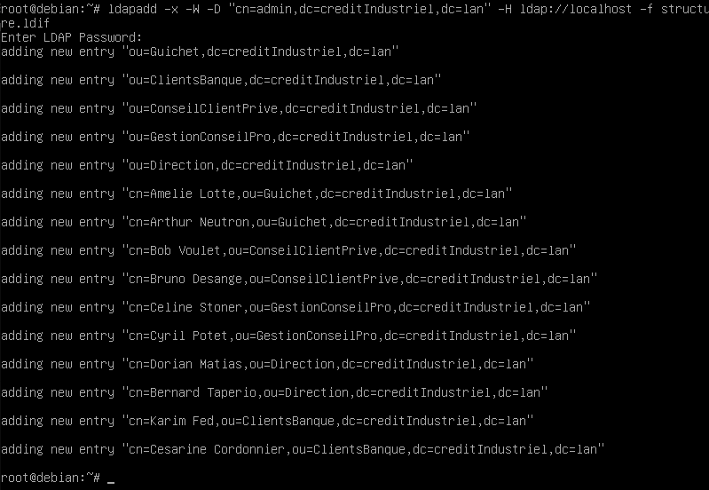
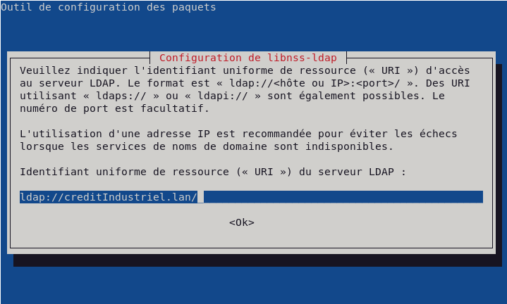
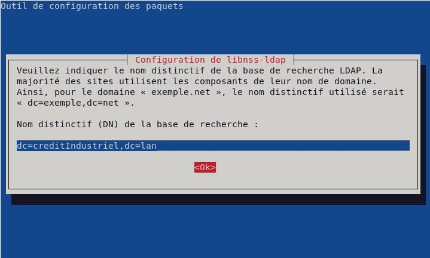
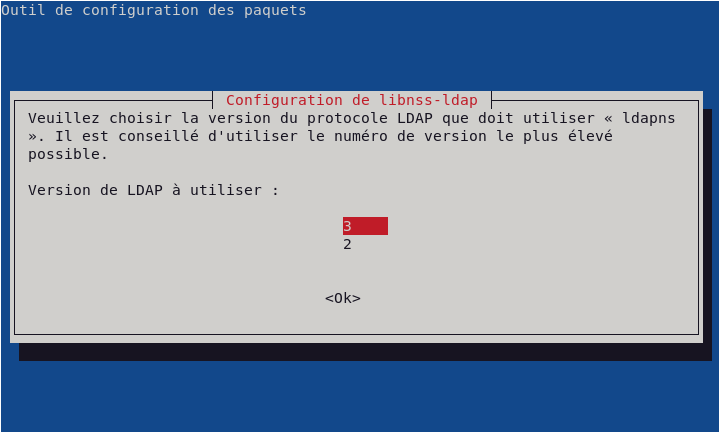
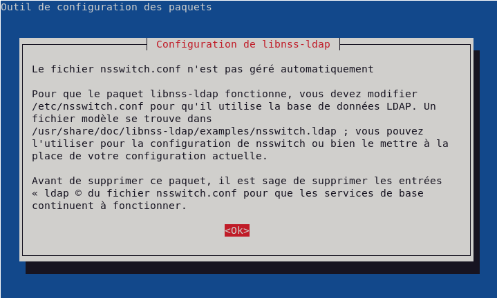
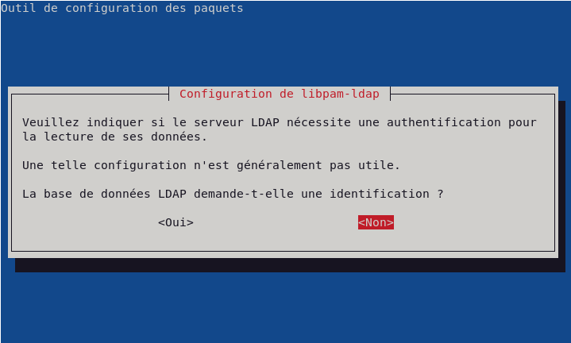
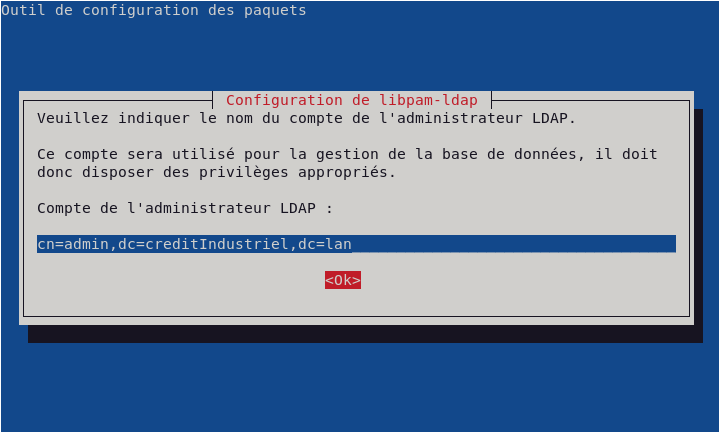
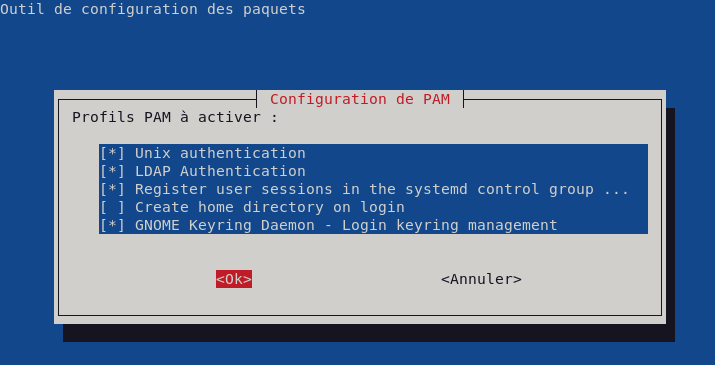

- # LDAP
	-
	- ## Installation LDAP
		- `sudo apt-get install slapd ldap-utils`
		- Pas besoin de mettre un mot de passe, on va le définir plus tard.
		-
		- `sudo dpkg-reconfigure slapd`
		- Choisir <Non>
		- Choisir le nom de domaine DNS pour établir le DN (Distinguished Name) de l'annuaire LDAP :
		- `creditIndustriel.lan`
		- Choisir le nom d'entité "organisation" :
		- `creditIndustriel`
		- Définir le mot de passe de l'administrateur :
		- `****`
		- `****`
		- Choisir s'il faudra supprimer la base de données lors de la purge du paquet (<Non>)
		- Choisir <Oui> pour déplacer l'ancienne base de données car les fichiers présents dans /var/lib/ldap provoqueraient l'échec de la procédure de configuration.
		-
	- ## Vérification de l'installation
		- La racine du DIT (Directory Information Tree) a été configuré à "dc=creditIndustriel,dc=lan", donc on peut le visualiser en faisant :
		- `sudo ldapsearch -Q -L -Y EXTERNAL -H ldapi:/// -b dc=creditIndustriel,dc=lan`
		- `-Q`
		- active le mode silencieux pour l’authentification SASL.
		- `-Y`
		- indique le mode SASL choisi pour l’authentification. Normalement, EXTERNAL implique une authentification par certificat client, mais dans ce cas-là, ça signifie que l’authentification se fera par l’UID et le GID du compte système. C’est pour ça que vous devez lancer la commande avec “sudo”. L’utilisateur root a des passe-droits pour accéder à la base locale LDAP. :)
		- `-L`
		- indique d’afficher le résultat au format LDIF. On aurait pu indiquer  -LLL  pour avoir la même chose sans toutes les lignes commentées.
		- `-H`
		- indique l’URI qu’on veut utiliser pour se connecter. Ici  ldapi:///  dit de se connecter à la socket Unix en local (la communication passe par un fichier local plutôt que par le réseau).
		- `-b`
		- indique le nœud à partir duquel vous voulez faire votre recherche. Ici  dc=mon-entreprise,dc=com  est la racine donc vous recherchez dans tout le DIT. À la suite du nœud, vous auriez pu indiquer des filtres pour votre recherche, mais sans filtre vous avez l’affichage le plus complet.
	-
	- ## Structure du DIT
		-
		- 
		  collapsed:: true
			-
			-
			-
	-
	- ## Le format ldif
		- LDIF (LDAP Directory Interchange Format) est un format créé pour décrire les ajouts ou les modifications à réaliser dans un annuaire LDAP. Le format d'une entrée dans un fichier LDIF est toujours de la forme suivante :
			- `dn: <Le dn que vous voulez changer>`
			- `changetype: <add, replace ou delete. Cette ligne est optionnelle>`
			- `<attribut ou objectclass>: valeur`
		- Il faut créer un fichier ldif qui contient les entrées en respectant l'ordre hiérarchique (on ne peut pas ajouter un objet dans une OU qui n'est pas encore créée)
		- Pour permettre une connexion à une session, il faut ajouter aux utilisateurs `objectclass: posixAccount`, certains attributs de l'objectClass posixAccount sont nécessaires :
			- uid (identifiant unique)
			  uidNumber (numéro d'identifiant unique)
			  gidNumber (numéro de groupe)
			  homeDirectory (répertoire personnel)
			  loginShell (interpréteur de commandes)
			- 
		- exemple de fichier ldif :
			- [structure.ldif](../assets/structure_1673718719067_0.ldif)
		- puis il faut les ajouter à l'annuaire :
			- `ldapadd -x -W -D "cn=admin,dc=creditIndustriel,dc=lan" -H ldap://localhost -f structure.ldif`
			- On peux si nécessaire ajouter l'option "-c" de la commande ldapadd qui permet de continuer à traiter les entrées de l'annuaire LDAP même si une erreur se produit.
		- 
	- ## Configuration du client
		- Ajouter l'adresse du serveur dans `/etc/hosts`
			- `sudo nano /etc/hosts`
			- `192.168.1.200   creditIndustriel.lan`
		- Faire un update et upgrade :
			- `apt update && apt upgrade`
		- Installer libnss-ldapd :
			- `apt install libnss-ldapd`
			-  Le `/`final est important.
			- {:height 323, :width 525}
			- 
			- 
			- 
			- {:height 323, :width 525}
			- 
			- 
			- Si nécessaire, mettre à jour la configuration du PAM :
				- `sudo pam-auth-update`
				- 
		- Modifier `/etc/nsswitch.conf`
			- `passwd: compat ldap`
			- `group: compat ldap`
			- `shadow: compat ldap`
			- Activer la création d'un home au premier login en ajoutant la ligne suivante dans le dossier `/etc/pam.d/common-session`:
				- `session optional pam_mkhomedir.so skel=/etc/skel umask=077`
	- ## Test de liaison avec l'annuaire
		- `ldapsearch -x -h "creditIndustriel.lan" -b "o=creditIndustriel"`
		- La commande "getent" permet d'afficher les entrées d'un service de noms de système (NSS), comme les utilisateurs, les groupes, les services, les réseaux, etc. On peut l'utiliser pour vérifier que les utilisateurs sont pris en compte, par ex :
			- `getent passwd alotte`
			- Si la commande ne revoie rien, l'utilisateur n'est pas pris en compte, sinon :
				- `alotte:*:2000:2000:Amelie Lotte:/home/alotte:/bin/bash`
		- Switcher sur l'utilisateur :
			- `sudo su - alotte`
	- ## Souces
		- Use the ldapsearch command line tool to troubleshoot your LDAP (Lightweight Directory Access Protocol) configuration :
		- https://www.ibm.com/docs/en/cloud-private/3.2.0?topic=ldap-troubleshooting-configuration
		- Authentification LDAP depuis le client GNU / Linux :
		- http://eole.ac-dijon.fr/documentations/2.5/partielles/HTML/ClientsGnuLinux/co/30-configurationClient.html
		- https://openclassrooms.com/fr/courses/1733551-gerez-votre-serveur-linux-et-ses-services/5236041-gerez-votre-annuaire-ldap
		- https://computingforgeeks.com/how-to-configure-ubuntu-as-ldap-client/