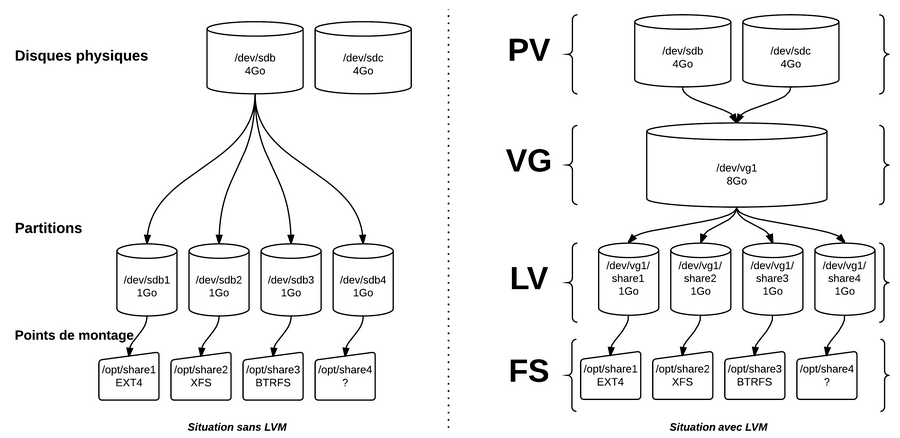

- RAID (Redundant Array of Independent Disks) => regroupement redondant de disques indépendants.
-
- Controleurs SATA.
-
- Visualiser les disques et partitions :
	- `sudo fdisk -l`
	- `lsblk`
	- `df -h`
-
- ### Étapes :
	- `apt install gdisk`
	- Les disques doivent avoir une partition GPT donc pour chaque disque faire:
		- `gdisk /dev/sdX`
		- On appuie sur o pour créer une nouvelle table de partition GPT puis sur Entrée (confirmer avec Y et Entrée)
		- On appuie sur n pour créer une nouvelle partition. Pour le numéro de partition, laissez par défaut. Pour ma part, c'est 1 puisque mes disques ne contiennent pas d'autres partitions. Il y a de fortes chances pour que ce soit la même chose chez vous.
		- Pour le choix du First Sector, laissez le choix par défaut. Cela devrait vous créer une partition à partir du secteur 2048.
		- Idem pour le last sector, laissez par défaut.
		- Pour le code de la partition, entrez fd00 cela correspond à Linux RAID
		- Appuyez sur w pour enregistrer les changements et quitter gdisk (confirmer avec Y et Entrée)
	- `apt install mdadm` Outil de gestion du RAID`
	- On vérifit que tout est bon :
		- `mdadm -E /dev/sd[b-h]`
	- Créer une grappe :
		- `mdadm --create /dev/md0 --level=6 --raid-devices=7 /dev/sd[b-h]1`
	- Pour contrôler l'avancement :
		- `cat /proc/mdstat`
	- Création d'un système de fichier ext4 sur la grappe RAID :
		- `mkfs.ext4 /dev/md0`
	- Montage du RAID
		- `mkdir /mnt/monraid`
		- De manière temporaire :
			- `mount /dev/md0 mnt/monraid`
		- Pour un montage au démarrage ajouter dans `/etc/fstab` :
			- `/dev/md0      /mnt/monraid      ext4      defaults      0      0`
- ### LVM
	- {:height 278, :width 555}
	- PV => Physical Volume
	- VG => Volume Group
	- LV => Logical Volume
	- FS => File System
	- `apt install lvm2`
	- ? Je sais plus pourquoi ni si c'est utile :
		- ?# dd if=/dev/zero of=/dev/diskname bs=1k count=1
		- ?# blockdev --rereadpt /dev/diskname
	- Créer une partition sur chaque disque :
		- `fdisk /dev/sdX`
			- `n`
			- `p`
			- `1`
			- `<enter>`
			- `<enter>`
			- `w`
	- Initier les volumes physique :
		- `pvcreate /dev/sdX`
	- Créer groupe de volumes :
		- `vgcreate mvg /dev/sdi1 /dev/sdj1 /dev/sdk1`
	- Visualiser le groupe de volumes :
		- `vgdisplay`
	- Créer le(s) volume(s) logique :
		- `lvcreate -n Vol1 -L 2.98g mvg`
	- On crée le système de fichiers :
		- `mkfs -f ext4 /dev/mvg/Vol1`
	- Montage :
		- `mkdir /mnt/LVM`
		- `chown :sambashare /mnt/LVM`
		- `chmod -R g+rw /mnt/LVM`
		- Temporaire :
			- `mount /dev/mvg/Vol1 /mnt/Vol1`
		- À chaque démarrage, dans /etc/fstab :
			- `/dev/mvg/Vol1 /mnt/LVM ext4 defaults 0 0`
-
-
- ### Sources :
	- https://tutobox.fr/linux-3-commandes-lister-les-disques-et-les-partitions
	- https://www.justegeek.fr/tuto-creer-raid-logiciel-mdadm-debian/
	- https://linux.goffinet.org/administration/disques-et-stockage-lvm/stockage-lvm/