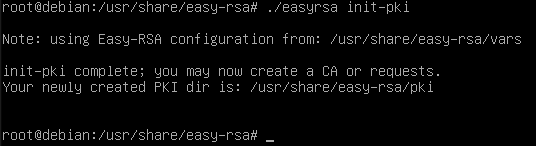
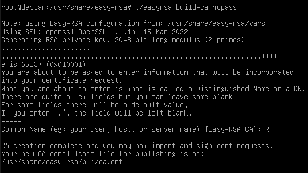
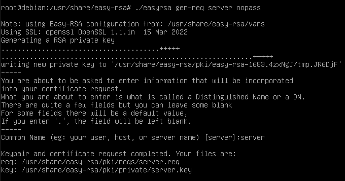
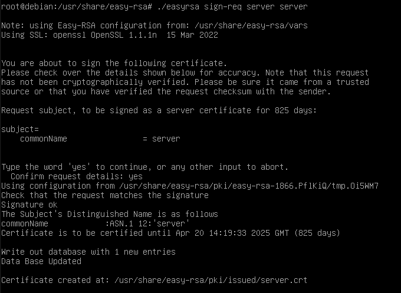
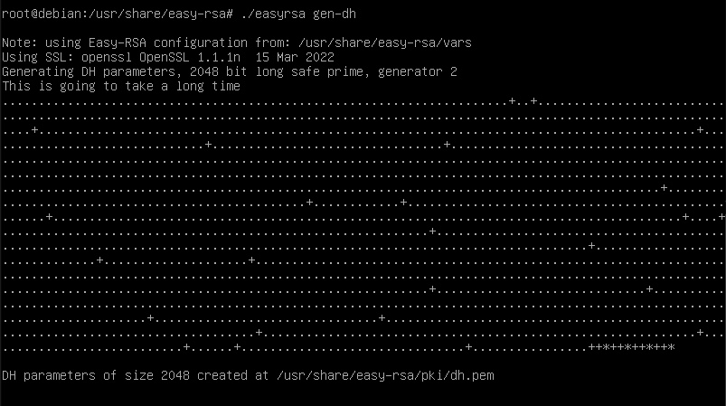
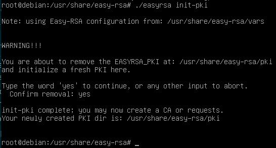
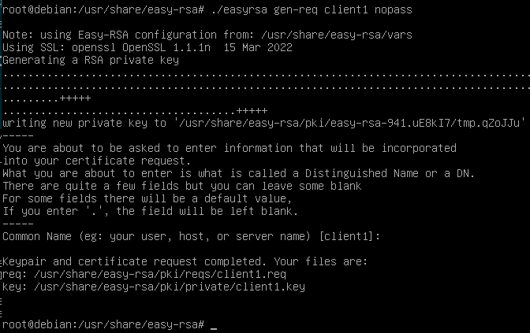
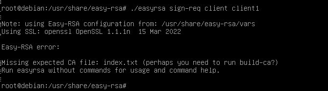

- # Open VPN
	- ## Installation
		- `apt-get install openvpn easy-rsa`
	- ## Easy-RSA et certificats serveurs
		- `cd /usr/share/easy-rsa/`
		- `cp vars.example vars`
		- Éditer `vars`, ajouter à la fin :
			- `set_var EASYRSA_REQ_COUNTRY    "FR"`
			  `set_var EASYRSA_REQ_PROVINCE   "FRANCE"`
			  `set_var EASYRSA_REQ_CITY       "Marseille"`
			  `set_var EASYRSA_REQ_ORG        "komptaplusbien.com"`
			  `set_var EASYRSA_REQ_EMAIL      "contact@komptabienplus.com"`
			  `set_var EASYRSA_REQ_OU         "OUVPN"`
		- `chmod +x vars`
		- `./easyrsa init-pki`
			- {:height 154, :width 535}
		- Créer les certificats du serveur :
			- `./easyrsa build-ca nopass`
				- 
		- Créer les clés publiques et privées, ici elles se nomment server :
			- `./easyrsa gen-req server nopass`
				- 
		- `./easyrsa sign-req server server`
			- {:height 392, :width 525}
		- `./easyrsa gen-dh`
			- {:height 302, :width 525}
		- `openvpn --genkey secret ta.key`
		- `mv /usr/share/easy-rsa/ta.key /usr/share/easy-rsa/pki/`
	- ## Configurer le serveur OpenVPN
		- Le fichier de configuration est à mettre dans  `/etc/openvpn/server/`. Sur debian il y a un exemple sur `/usr/share/doc/openvpn/exemples/sample-config-files/server.conf`
			- `cp /usr/share/doc/openvpn/exemples/sample-config-files/server.conf /etc/openvpn/server/server.conf`
		- Modifier `/etc/openvpn/server/server.conf` :
			- Ajouter l'adresse ip du serveur `local 192.168.1.200`
			- Laisser les autres options comme elles sont.
		- Créer un lien symbolique pour récupérer les clés :
			- `ln -s /usr/share/easy-rsa/pki /etc/openvpn/server/pki`
	- ## Créer des certificats et clés du client
		- `cd /usr/share/easy-rsa`
		- `./easyrsa init-pki`
			- {:height 301, :width 546}
		- `./easyrsa gen-req client1 nopass`, pour créer la clé et le certificat du client :
			- 
		- On signe le client : `./easyrsa sign-req client client1`
			- ## error !
			- 
			- >Chat GPT :
			- >"easy-RSA error: Missing expected CA file: index.txt" est un message d'erreur qui indique qu'un fichier requis, "index.txt", est manquant dans le répertoire de clés de certificat (ou "Public Key Infrastructure", ou PKI) pour un serveur OpenVPN. Ce fichier est utilisé pour stocker des informations sur les certificats qui ont été créés et signés par la CA. Il est nécessaire pour que les commandes Easy-RSA fonctionnent correctement.
			- >Il est possible que vous ayez oublié d'utiliser la commande "./easyrsa init-pki" pour initialiser le répertoire PKI avant d'utiliser les autres commandes Easy-RSA, ou que le fichier "index.txt" a été supprimé accidentellement. Pour résoudre ce problème, vous devriez utiliser la commande "./easyrsa init-pki" pour réinitialiser le répertoire PKI, ou restaurer le fichier "index.txt" à partir d'une sauvegarde si vous en avez une.
		- L'erreur vient du fait qu'il n'y ai pas d'autorité de certification, il faut la recréer en faisant `./easyrsa build-ca nopass` : Cette commande permet de créer une autorité de certification (CA) pour easy-rsa. Elle crée un certificat racine qui peut être utilisé pour signer les certificats des clients et du serveur.
		- On peut ensuite signé sans erreur : `./easyrsa sign-req client client1`
	-
	- ## Sources :
		- https://www.malekal.com/comment-installer-openvpn-sur-ubuntu-debian/
		- https://opensource.com/article/21/7/openvpn-firewall