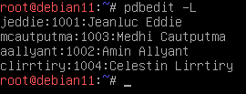
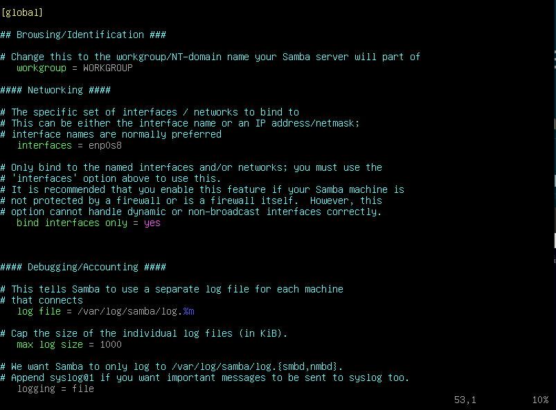
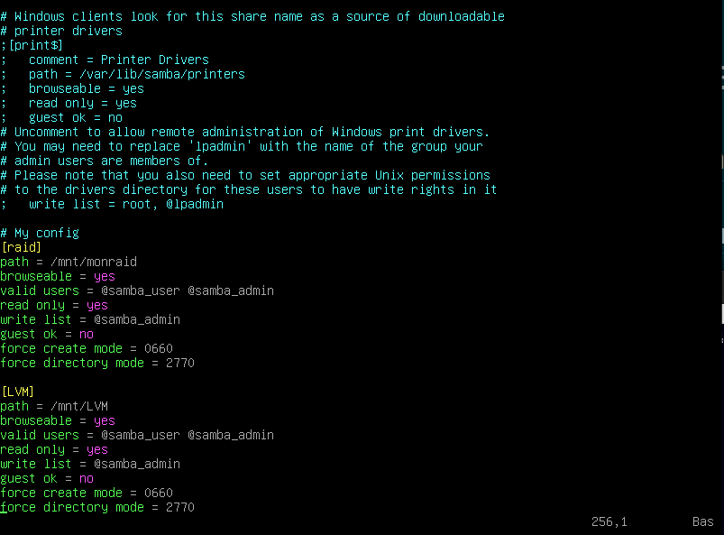

- # Samba
-
- ## installation et configuration :
	- `apt install samba`
	- Créer les groupes :
		- `addgroup samba_admin`
		- `addgroup samba_user`
	- Créer les utilisateurs :
		- `adduser <user>`
	- Définir les mots de passe pour samba :
		- `smbpasswd -a <username>`
	- Voir les utilisateurs SAMBA :
		- `pdbedit -L`
		- 
	- Ajouter les utilisateurs au groupe adéquate :
		- `gpasswd -a <user> <group>`
	- Éditer le fichier de configuration `/etc/samba/smb.conf`:
		- 
		- 
- ## Montage sur le client
	- `sudo mount -t cifs //192.168.1.222/samba /mnt/samba -o username=aallyant,password=smbaa,uid=user1,rw`
	- Pour démonter :
		- `sudo umount /mnt/samba`
		-
-
-
-