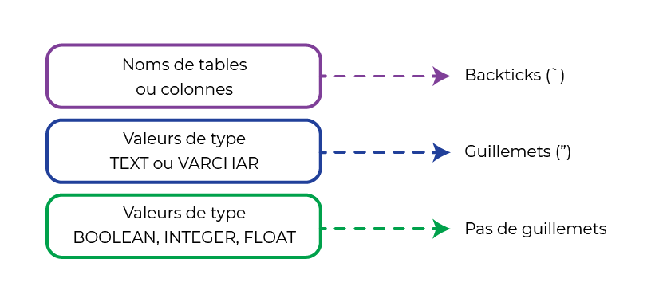
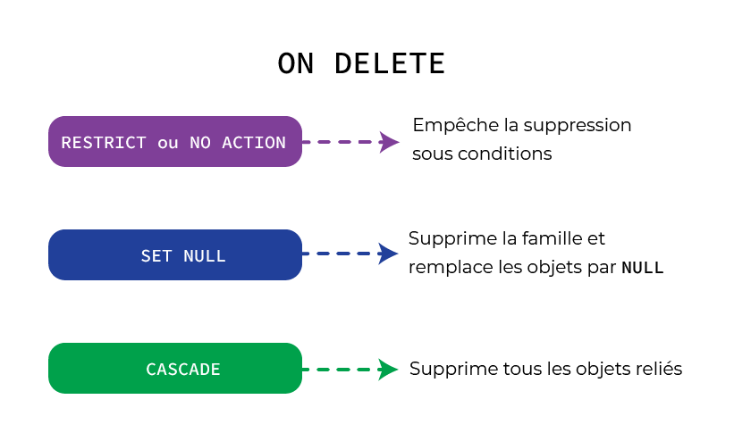

- ## Connexion à la BDD
- ```bash
  mysql -u root -p
  ```
- ## Création de la database
- Créer une base de données
  ```sql
  CREATE DATABASE dbname;
  ```
- Utiliser une base en particulier
  ```sql
  USE dbname;
  ```
- Voir les bases de données disponibles
  ```sql
  SHOW DATABASES;
  ````
- Créer une nouvelle table
  ```sql
  CREATE TABLE my_table (
  id INTEGER NOT NULL AUTO_INCREMENT PRIMARY KEY,
  name VARCHAR(100),
  email VARCHAR(255) NOT NULL UNIQUE
  );
  ```
- Vérifier la création des tables et des champs
  ```sql
  SHOW TABLES;
  SHOW COLUMNS FROM my_table;
  ```
- Charger une base de données (Il faut avoir créé la BDD avant dans mysql)
  ```bash
  mysql -u root -p dbname < file.sql
  ```
- Exporter une database
  ```bash
  mysqldump -u [Nom d'utilisateur SQL] -p [Nom de la DB] > data-dump.sql
  ```
- ## Insertion d'objets
- ```sql
  INSERT INTO `my_table` (`name`, `age`)
  VALUES ('John', 30);
  ```
- On peut aussi en mettre plusieurs à la fois :
- ```sql
  INSERT INTO `my_table` (`name`, `age`)
  VALUES 
  ('John', 30),
  ('Alice', 25),
  ('Luis', 38);
  ```
- 
- ## Selection
- ```sql
  SELECT name, age FROM my_table;
  ```
- ## Mettre à jour
- ```sql
  UPDATE my_table
  SET name = 'NewName', age = 35
  WHERE id = 1;
  ```
- ## Supprimer un objet d'une table
- ```sql
  DELETE FROM my_table WHERE `id` = '2';
  ```
- ## Supprimer une table
- ```sql
  DROP TABLE my_table;
  ```
- ## Supprimer une database
- ```sql
  DROP DATABASE `my_database`;
  ```
- ## Isoler un objet à partir de comparaison sur du texte
- ```sql
  SELECT * FROM user WHERE email LIKE "%gmail.com";
  ```
- ## Ordonner les resultats
- ```sql
  SELECT * FROM user ORDER BY age ASC;
  ```
- ## fonctions
- `SUM()` : Calcule la somme des valeurs d'une colonne.
- `COUNT()` : Compte le nombre de lignes dans un résultat.`
- `AVG()` : Calcule la moyenne des valeurs d'une colonne.
- `MAX()` : Retourne la valeur maximale d'une colonne.
- `MIN()` : Retourne la valeur minimale d'une colonne.
- `UPPER()` : Convertit une chaîne en majuscules.
- `LOWER()` : Convertit une chaîne en minuscules.
- `LEFT()` : Retourne la partie gauche d'une chaîne.
- `RIGHT()` : Retourne la partie droite d'une chaîne.
- `LENGTH()` : Retourne la longueur d'une chaîne.
- `NOW()` : Retourne la date et l'heure actuelles.
- `DATEDIFF()` : Calcule la différence entre deux dates.
- `ROUND()` : Arrondit une valeur à un nombre spécifié de décimales.
- `DISTINCT()` : Éliminer les doublons.
- ## Vues
- MySQL a un système de “vues” qui permet de créer des tables temporaires à partir d’une commande SQL.
- ```sql
  CREATE VIEW tpmtable_vw AS
      ( SELECT *
        FROM user
        WHERE emai LIKE "%gmail.com"
      );
  ```
- La convention chez les utilisateurs de SQL est de toujours suffixer le nom d’une vue avec “_vw”, pour la distinguer des “vraies” tables.
- ## Table de liaison et joint
- Créer une table de liaison
- ```sql
  CREATE TABLE table1_table2 (
  table1_id INT NOT NULL,
  table2_id INT NOT NULL,
  FOREIGN KEY (table1_id) REFERENCES table1 (id) ON DELETE RESTRICT ON UPDATE CASCADE,
  FOREIGN KEY (table2_id) REFERENCES table2 (id) ON DELETE RESTRICT ON UPDATE CASCADE,
  PRIMARY KEY (table1_id, table2_id)
  );
  ```
- J'utilise ici la table de liaison `user_food` qui fait le lien entre `user`et `food`:
- ```sql
  SELECT user.name AS name, food.name AS food
  FROM user
  JOIN user_food ON (user.id = user_food.user_id)
  JOIN food ON (food.id = user_food.food_id);
  ```
- ## Modifier la structure d'un objet
- Ajouter un champ à une table
  ```sql
  ALTER TABLE my_table ADD field INT;
  ```
- Supprimer un champ
  ```sql
  ALTER TABLE my_table DROP field;
  ```
- Modifier un champ existant
  ```sql
  ALTER TABLE my_table MODIFY field INT;
  ```
- Renommer un champ (Respécifier le type de la colonne est une spécificité MySQL)
  ```sql
  ALTER TABLE my_table CHANGE oldname newname INT;
  ```
- Créer et déclarer une clé étrangère
  ```sql
  ALTER TABLE my_table
  ADD othertable_id INT NULL;
  
  ALTER TABLE my_table
  ADD FOREIGN KEY (othertable_id) REFERENCES othertable (id)
  ON DELETE CASCADE;
  ```
- 