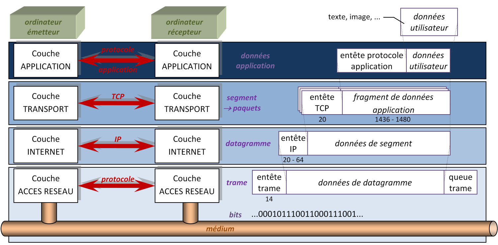

- # reconnaissance
- ## tools
	- whois <domain>
	- host <domain> or <adsress>
	- dig <address>
	- dnsenum <address>
	- dmitry -iwnse <address>
	- tcptraceroute <address>
	- theharvester -d google.com -l 100 -b google
	- maltego
- ## websites
- BDDs public :
	- whois.net
	- alexa.com
- # prise d'informations
- 
	- ping
	- wireshark
	- arping
	- fping -r 1 -g 192.168.1.0/24
	- hping3 -1 192.168.1.10 -c 1
		- 
	- nping
- ## scan et prise d'empreinte
	- nmap
	- zenmap (graphique)
	- nessus (peut appeler hydra)
	- unicornscan
	- amap
	- nbtscan
	- onesixtyone