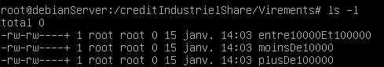

- # ACL
-
	- ## Installation :
		- Si il n'est pas installé, on peut le faire avec apt :
			- `apt install acl`
	- ## Préparation :
		- Selon certains tutoriels, avant de démarrer avec les ACLs, il faut que le système de fichiers soit monté de façon à les supporter car ses métadonnées devrons être étendues.
		- Pour activer les ACL sans rédémarrer le système :
			- `mount -o remount,acl /dev/sda1`
		- On peut ajouter dans `/etc/fstab`:
			- `/dev/sda1 / ext4 acl,errors=remount-ro 0 1`
	- ## Utilisation :
		- Si un fichier a des droits gérés par ACL, on peut voir un `+` en faisant `ls -l`
			- 
		- Pour voir le détail des ACL :
			- `getfacl nomfichier`
		- Ajouter des droits :
			- `setfacl -m g:group1:rwx file.txt`
	- ## Sources :
		- https://linux.goffinet.org/administration/securite-locale/access-control-lists-acls-linux/
		- https://www.linuxpedia.fr/doku.php/expert/acl_posix